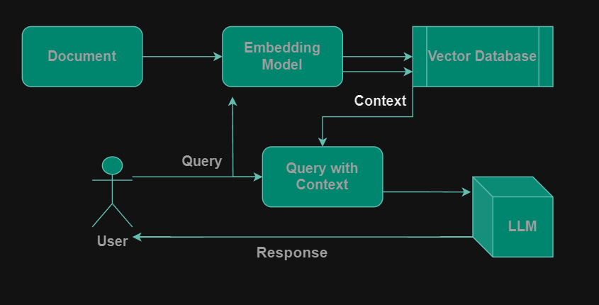

# RAG Interview Bot

This project demonstrates a Retriever-Augmented Generation (RAG) model for an interview chatbot. The system uses a combination of document retrieval and language generation to provide relevant and context-aware responses to user queries. It integrates Pinecone for document storage and retrieval, Google Gemini for content generation, and HuggingFace embeddings for document vectorization.

## Project Overview

### Features:
- **Retriever-Augmented Generation (RAG)**: Uses a retriever to fetch relevant documents based on user input, then generates responses using a generative language model (Google Gemini).
- **Pinecone Integration**: Stores and retrieves document embeddings from a Pinecone index.
- **Google Gemini Integration**: Generates human-like responses based on retrieved documents.
- **Streamlit Interface**: Provides a simple web interface to interact with the bot.

### Flow:
1. **Data Ingestion**: Raw text data is scraped and preprocessed into text chunks.
2. **Embedding Generation**: HuggingFace embeddings are used to vectorize the text chunks.
3. **Document Storage**: The vectorized text chunks are stored in Pinecone for efficient retrieval.
4. **Query Handling**: When a user inputs a query, the retriever fetches the most relevant documents from Pinecone.
5. **Response Generation**: The retrieved documents are passed as context to the Google Gemini model, which generates a response based on the query and context.
6. **Output**: The response is displayed to the user.

---
### RAG Architecture Diagram


---


## Setup Instructions

### Prerequisites:
- Python 3.8 or higher
- API keys for [Pinecone](https://www.pinecone.io/) and [Google Gemini](https://cloud.google.com/genai)

### Install Dependencies:

```bash
pip install -r requirements.txt
```

## Environment Variables:
Create a .env file in the root directory with the following keys:

```
PINECONE_API_KEY=your_pinecone_api_key
GOOGLE_API_KEY=your_google_api_key
```

## Run the Application:
### Create Vector Database:
```bash
python store_index.py
```

### Start the Streamlit Application:
Run the Streamlit app to interact with the bot.

```bash
streamlit run app.py
```


## Code Structure:
- app.py: The main entry point for the Streamlit app.

- src/helper.py: Contains utility functions such as download_hugging_face_embeddings, load_files, text_split, etc.
- gemini_rag.py: Contains the logic for document retrieval and response generation using the Pinecone vector store and the Google Gemini API.
- store_index.py: Create vector database.
- Environment Configuration: Initializes the API keys and sets up environment variables.
